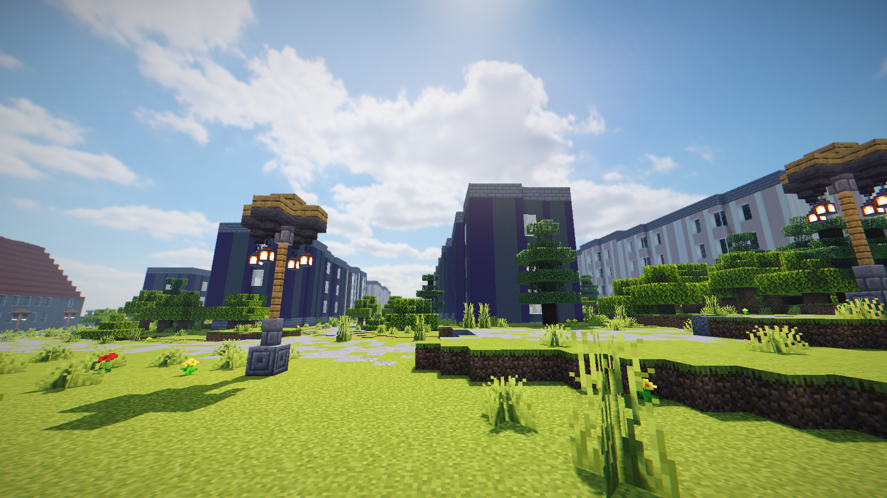

# Brno city Minecraft world generator

This is a repository of a project, that takes open Brno data and uses it in order to generate a Minecraft map of Brno city



## Usage

This is a plugin for a Paper 1.18 server.

### Database

It requires a [PostGIS](https://postgis.net/) database containing at least following data with coordinates in the [WGS84](https://cs.wikipedia.org/wiki/World_Geodetic_System)

- `brno_buildings` - [Indicative 3D Building Model](https://data.brno.cz/maps/mestobrno::orienta%C4%8Dn%C3%AD-3d-model-budov-indicative-3d-building-model/about) from data.brno.cz
- `brno_lights` - [Street lights](https://data.brno.cz/datasets/sloupy-ve%C5%99ejn%C3%A9ho-osv%C4%9Btlen%C3%AD-l-street-lights/explore?location=49.202289%2C16.621244%2C13.72) from data.brno.cz (this dataset needs to have the diacritics removed from the column names)
- `brno_terrain` - [Brno Digital Terrain Model 2019](https://data.brno.cz/datasets/mestobrno::digit%C3%A1ln%C3%AD-model-ter%C3%A9nu-brna-2019-brno-digital-terrain-model-2019-wgs/about) from data.brno.cz
- `brno_trees` - [Greenery registry - trees, bushes](https://data.brno.cz/datasets/pasport-zelen%C4%9B-stromy-ke%C5%99e-greenery-registry-trees-bushes) from data.brno.cz
- `osm_roads` - [OpenStreetMaps export](https://download.geofabrik.de/europe/czech-republic.html) with all the roads

### Plugin

The plugin requires [Multiverse core](https://dev.bukkit.org/projects/multiverse-core) and [Worldedit](https://dev.bukkit.org/projects/worldedit) in order to work.

In the Multiverse, create a world with the `terraingen` world generator

```
/mv create <world name> normal -g terraingen
```


## Configuration

In the `[path/to/server]/plugins/terraingen`, you will see `configuration.json` after the first run. It contains the database configuration as well as the multiverse world name used for the map.

If you want to include the buildings placeable with the `/buildings` command, create a file `buildings.csv` with the rows in the following format:
`<Path to the schematic>;<X>;<Y>;<Z of the origin of the model>`.

## License

All Rights Reserved.

Copyright © 2022 Jonáš Rosecký, Vojtěch Brůža
